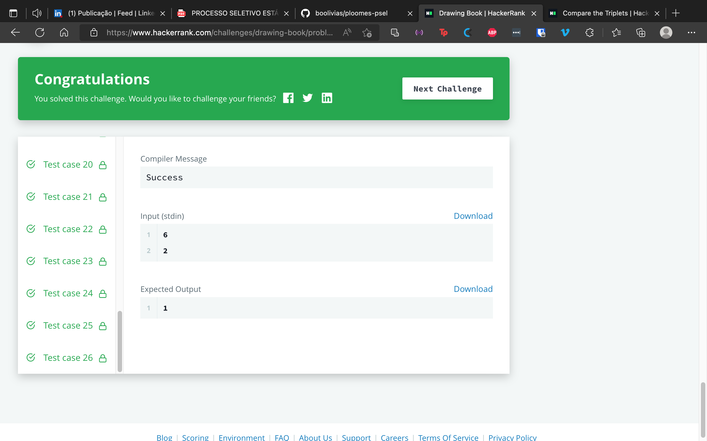
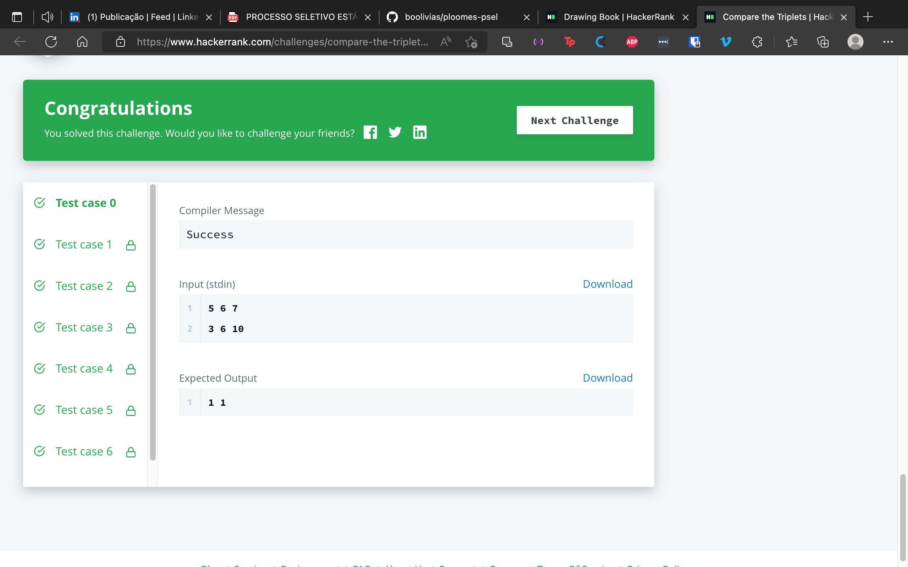

# Desafio Ploomes
Consiste em escolher 2 desafios do HackerRank dentre as opções e resolver em Javascript.

# Resultado
Imagens com o desempenho da solução,ainda na plataforma do HackerRank.

## 1. Drawing book

## 2. Compare the triplets

---

## Autor

- ### Jean Wylmer ([@boolivias](https://github.com/boolivias))

 